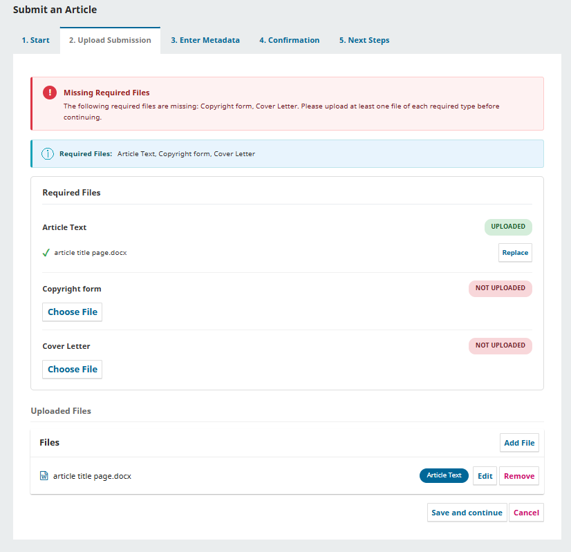
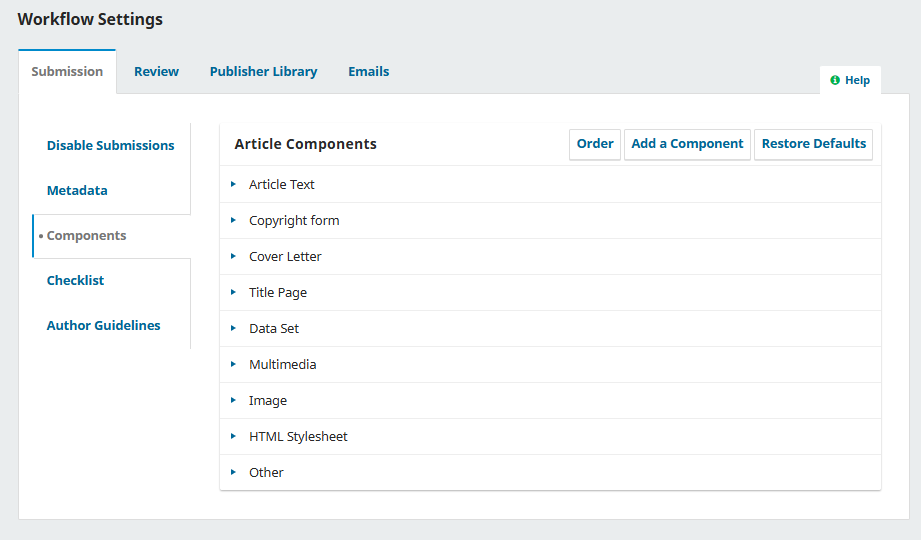

# Required Submission Files for OJS 3.3+

A generic plugin for [Open Journal Systems (OJS)](https://pkp.sfu.ca/software/ojs/) that allows journal editors to enforce mandatory file uploads during article submission.

**[Türkçe](#tr)** | **[English](#en)**

---

## Why This Plugin?

OJS lets authors skip the file upload step (Step 2) entirely or upload only some of the expected documents. This can lead to incomplete submissions that editors must chase down later, slowing the review process.

**Required Submission Files** solves this by letting editors define which article component types (e.g., Manuscript, Cover Letter, Copyright Form) must be uploaded before a submission can proceed. Authors see a clear panel showing exactly which files are needed and which have been uploaded.

## Features

- **Per-journal configuration** - Editors select required file types from existing article components via the plugin settings.
- **Dedicated upload panel** - A required files section appears above the standard OJS file list on Step 2, with per-genre upload slots.
- **Real-time status badges** - Each required file type shows a clear "Uploaded" or "Not uploaded" status badge.
- **Auto-upload** - Files begin uploading immediately upon selection, matching standard OJS behavior.
- **Persistent error banner** - When required files are missing, a non-dismissible error banner lists exactly which file types are needed.
- **Info banner** - An always-visible banner lists all required file types, turning green when all are satisfied.
- **Bidirectional sync** - Files uploaded via the required panel appear in the standard OJS file list below, and vice versa. Deletions from either section stay in sync.
- **Validation bypass protection** - The plugin resets submission progress when required files are missing, preventing authors from bypassing validation through page refresh or direct URL access.
- **No external dependencies** - Uses only OJS built-in APIs and standard browser APIs.
- **Multilingual** - Ships with English and Turkish translations.

## Requirements

- OJS 3.3.0 or later
- PHP 7.4 or later

## Installation

### Via Upload (Recommended)

1. Download the latest `.tar.gz` release from the [Releases](../../releases) page.
2. In OJS, go to **Settings > Website > Plugins > Upload A New Plugin**.
3. Upload the `.tar.gz` file and confirm the installation.
4. Enable the plugin under **Generic Plugins**.

### Manual Installation

1. Extract the plugin files to `plugins/generic/requiredFiles/` within your OJS installation.
2. Navigate to **Settings > Website > Plugins**.
3. Find "Required Submission Files" under Generic Plugins and enable it.

## Configuration

1. After enabling the plugin, click **Settings** next to the plugin name.
2. Select the article component types that should be required during submission.
3. Click **Save**.

> **Note:** The component types listed in the settings are managed under **Workflow > Submission > Components**. Use that section to add or modify component types before configuring this plugin.

## Screenshots

**Plugin Settings / Eklenti Ayarlari:**

**Missing Required Files / Eksik Zorunlu Dosyalar:**

**OJS Components / OJS Bilesenleri:**

## License

This plugin is licensed under the GNU General Public License v3.0. See [LICENSE](LICENSE) for details.

---

# OJS 3.3+ için Zorunlu Gönderi Dosyaları

[Open Journal Systems (OJS)](https://pkp.sfu.ca/software/ojs/) için makale gönderisi sırasında zorunlu dosya yüklemelerini zorlayan genel eklenti.

## Bu Eklenti Neden Gerekli?

OJS, yazarların dosya yükleme adımını (Adım 2) tamamen atlamasına veya beklenen belgelerin yalnızca bir kısmını yüklemesine izin verir. Bu durum, editörlerin daha sonra takip etmesi gereken eksik gönderilere yol açar ve hakem sürecini yavaşlatır.

**Zorunlu Gönderi Dosyaları** eklentisi, editörlerin hangi makale bileşen türlerinin (örneğin Makale Metni, Üst Yazı, Telif Devir Formu) gönderim öncesi yüklenmesi gerektiğini belirlemesine olanak tanır. Yazarlar, hangi dosyaların gerektiğini ve hangilerinin yüklendiğini gösteren net bir panel görür.

## Özellikler

- **Dergi bazında yapılandırma** - Editörler, eklenti ayarları üzerinden mevcut makale bileşenlerinden zorunlu dosya türlerini seçer.
- **Özel yükleme paneli** - Adım 2'de standart OJS dosya listesinin üzerinde, tür bazında yükleme alanları içeren bir zorunlu dosyalar bölümü görüntülenir.
- **Anlık durum rozetleri** - Her zorunlu dosya türü için "Yüklendi" veya "Yüklenmedi" durumu açıkça gösterilir.
- **Otomatik yükleme** - Dosyalar seçilir seçilmez yükleme başlar, standart OJS davranışıyla uyumludur.
- **Kalıcı hata banneri** - Zorunlu dosyalar eksik olduğunda, hangi dosya türlerinin gerektiğini listeleyen kapanmayan bir hata banneri gösterilir.
- **Bilgi banneri** - Tüm zorunlu dosya türlerini listeleyen, tamamlandığında yeşile dönen bir bilgi banneri sürekli görünür.
- **Çift yönlü senkronizasyon** - Zorunlu panel üzerinden yüklenen dosyalar alttaki standart OJS listesinde de görüntülenir ve tam tersi. Silme işlemleri de senkronize kalır.
- **Doğrulama atlama koruması** - Eklenti, zorunlu dosyalar eksik olduğunda gönderi ilerlemesini sıfırlar; yazarların sayfa yenileme veya doğrudan URL erişimi ile doğrulamayı atlamasını önler.
- **Harici bağımlılık yok** - Yalnızca OJS yerleşik API'lerini ve standart tarayıcı API'lerini kullanır.
- **Çok dilli** - İngilizce ve Türkçe çevirilerle birlikte gelir.

## Gereksinimler

- OJS 3.3.0 veya üzeri
- PHP 7.4 veya üzeri

## Kurulum

### Yükleme ile (Önerilen)

1. [Releases](../../releases) sayfasından en son `.tar.gz` sürümünü indirin.
2. OJS'de **Ayarlar > Web Sitesi > Eklentiler > Yeni Eklenti Yükle** bölümüne gidin.
3. `.tar.gz` dosyasını yükleyin ve kurulumu onaylayın.
4. **Genel Eklentiler** altında eklentiyi etkinleştirin.

### Manuel Kurulum

1. Eklenti dosyalarını OJS kurulumunuzdaki `plugins/generic/requiredFiles/` klasörüne çıkarın.
2. **Ayarlar > Web Sitesi > Eklentiler** bölümüne gidin.
3. Genel Eklentiler altında "Zorunlu Gönderi Dosyaları"nı bulun ve etkinleştirin.

## Yapılandırma

1. Eklentiyi etkinleştirdikten sonra eklenti adının yanındaki **Ayarlar** düğmesine tıklayın.
2. Gönderi sırasında zorunlu olması gereken makale bileşen türlerini seçin.
3. **Kaydet**'e tıklayın.

> **Not:** Ayarlarda listelenen bileşen türleri **İş Akışı > Gönderi > Bileşenler** altında yönetilir. Bu eklentiyi yapılandırmadan önce bileşen türlerini eklemek veya düzenlemek için o bölümü kullanın.

## Lisans

Bu eklenti GNU Genel Kamu Lisansı v3.0 ile lisanslanmıştır. Detaylar için [LICENSE](LICENSE) dosyasına bakın.
